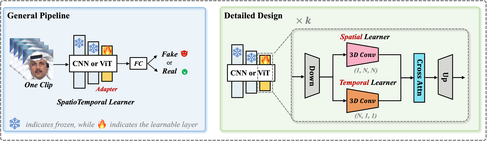
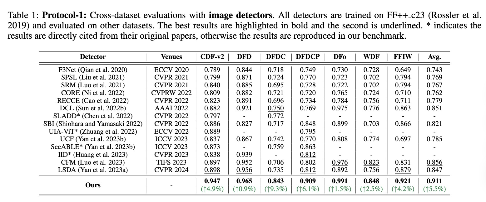
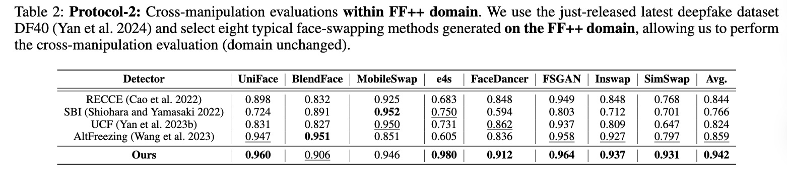
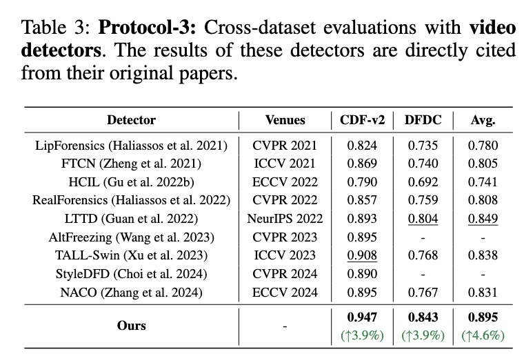

## Generalizing Deepfake Video Detection with Plug-and-Play: Video-Level Blending and Spatiotemporal Adapter Tuning 

### [Paper Link](https://arxiv.org/abs/2406.134950); [Pretrained Weights](https://docs.google.com/forms/d/1ESAWoWusOEGEEVnXCH_emv-wJqCYMhCbD6-85RMIoDk/edit)

[](https://creativecommons.org/licenses/by-nc/4.0/)   


### ***In this Repo, we introduce a new method called **StA** to equip a pretrained image model (such as CLIP) with the ability to capture both spatial and temporal features jointly and efficiently.***

Specifically, StA is designed with two-stream 3D-Conv with varying kernel sizes, allowing it to process spatial and temporal features separately.
g on FF++ and testing on CDF).

The figure below provides a brief introduction to the design of StA.

<div align="center"> 
</div>
<div style="text-align:center;">
  
</div>


---


The following tables display the results of our method on several deepfake detection benchmarks. **Please check our paper for details.**

<div align="center"> 
</div>
<div style="text-align:center;">
  
</div>


<div align="center"> 
</div>
<div style="text-align:center;">
  
</div>

<div align="center"> 
</div>
<div style="text-align:center;">
  
</div>

---


## ⏳ Quick Start
<a href="#top">[Back to top]</a>


### 1. Installation
Please run the following script to install the required libraries:

```
sh install.sh
```

### 2. Download ckpts for inference
The pretrained weights of "CLIP-l14 + our StA" training on FaceForensics++ are released at [Google Drive](https://drive.google.com/file/d/1WdmyPWKSR1kFE5dIsQvbb0MOGBUqUyjN/view?usp=sharing). 


### 3. Run demo
You can then infer **one video** (we provide an example video "simswap_000_003.mp4" for illustration) using the pretrained weights. 


## 💻 Reproduction and Development

<a href="#top">[Back to top]</a>


### 1. Download datasets

If you want to reproduce the results of each deepfake dataset, you can download the processed datasets (have already finished preprocessing such as frame extraction and face cropping) from [DeepfakeBench](https://github.com/SCLBD/DeepfakeBench). For evaluating more diverse fake methods (such as SimSwap, BlendFace, DeepFaceLab, etc), you are recommended to use the just-released [DF40 dataset](https://github.com/YZY-stack/DF40) (with 40 distinct forgery methods implemented).


### 2. Preprocessing (**optional**)

If you only want to use the processed data we provided, you can skip this step. 

Otherwise, you need to use the following codes for doing **data preprocessing strictly following DeepfakeBench**.


### 3. Rearrangement (**optional**)

> "Rearrangment" here means that we need to create a JSON file for each dataset for collecting all frames within different folders. Please refer to **DeepfakeBench** and **DF40** for the provided JSON files for each dataset.

After running the above line, you will obtain the JSON files for each dataset in the `./preprocessing/dataset_json` folder. The rearranged structure organizes the data in a hierarchical manner, grouping videos based on their labels and data splits (*i.e.,* train, test, validation). Each video is represented as a dictionary entry containing relevant metadata, including file paths, labels, compression levels (if applicable), *etc*. 


### 4. Training

First, you can run the following lines to train the model:
- For multiple GPUs:
```
python3 -m torch.distributed.launch --nproc_per_node=8 training/train.py \
--detector_path ./training/config/detector/clip_adapter.yaml \
--train_dataset FaceForensics++ \
--test_dataset Celeb-DF-v2 \
--ddp
```
- For a single GPU:
```
python3 training/train.py \
--detector_path ./training/config/detector/clip_adapter.yaml \
--train_dataset FaceForensics++ \
--test_dataset Celeb-DF-v2 \
```

### 5. Testing

Once finishing training, you can test the model on several deepfake datasets such as DF40.

```
python3 training/test.py \
--detector_path ./training/config/detector/clip_adapter.yaml \
--test_dataset simswap_ff blendface_ff uniface_ff fomm_ff deepfacelab \
--weights_path ./training/weights/sta_best.pth
```
Then, you can obtain similar evaluation results reported in our manuscript.
